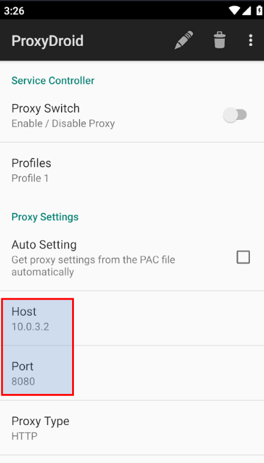

## Android Penetration Testing - Don’t Go Near Stubborn Proxies!

#### [27  ⁄  7  ⁄  2023]

<br>


<br>

In this post I want to talk about one of the challenges I encountered while performing a penetration test on an Android application written in Flutter.

<br>

### Introduction

For penetration testing, I use the **OWASP MASVS** methodology. The story is that one of the tasks you must perform during dynamic testing is checking the traffic between the application and the server. Usually, Android applications use **HTTP** or **WebSocket** protocols for this purpose, and our job is to analyze the communication with the endpoints.

For this task, I use the following tools:

- **Genymotion** – Android OS emulator  
- **Burp Suite** – Proxy and traffic analysis tool  

Install [Genymotion](https://www.genymotion.com/product-desktop/download/) and [Burp Suite](https://portswigger.net/burp/communitydownload) from their official websites. After installation, simply create an Android virtual device as shown in the documentation.


> Note: For the method I explain below, I used Android 9. I did not get results with versions 6 or 12.

The Android OS in Genymotion is rooted by default. After running it, you need to install an **ARM Translation** package on the emulator. For versions before Android 9, use the [appropriate ARM package](https://github.com/m9rco/Genymotion_ARM_Translation), and for later versions use the [corresponding package](https://github.com/niizam/Genymotion_A11_libhoudini). The output of these projects is a ZIP file that you should drag and drop onto the emulator. After that, the system will be flashed, and you will be able to install and use ARM applications on the emulator.

If you work in the web field, you know that to inspect the communication between a browser and a server using Burp Suite, you need to install Burp’s certificate in the browser. In Android, we must do the same thing, but the situation is a bit different. Android applications that use secure communication with TLS generally fall into one of the following three categories:

1. The application does not check the server certificate (disabled by default unless the developer implemented it).
2. The application trusts the operating system. That means if the OS trusts a certificate, the app also trusts it.
3. The application includes the server certificate value or its hash in its code and performs validation during the TLS handshake (this mechanism is called **Certificate Pinning**).

At this stage, we need to install Burp Suite’s certificate into the Android system. There are many [articles](https://blog.ropnop.com/configuring-burp-suite-with-android-nougat) explaining this process, so I won’t repeat it here.

Now you must configure a proxy on the Android system so that its traffic passes through your main system and Burp Suite. The server should be your host machine’s IP address, and the port should be the one Burp Suite is listening on. On Android, go to:

```
Settings > Network & Internet > Wi-Fi > Advanced Options > Proxy > Manual
```


If your application trusts system certificates, you will see HTTP or WebSocket traffic in Burp Suite. But if it uses Certificate Pinning, you will need to bypass it. For this, you can use [**Frida**](https://frida.re/). During dynamic testing, Frida allows you to hook specific functions in the application and replace them with your desired behavior. There are many [scripts](https://redfoxsec.com/blog/ssl-pinning-bypass-android-frida/) available for bypassing certificate pinning with Frida that you can use if you encounter this problem.

If you follow the above steps, your task becomes testing the endpoints and discovering vulnerabilities.

<br>

### Why Are Some Applications Stubborn?

During my tests, the first time I encountered a Flutter application, I noticed something strange. Even though Certificate Pinning was not enabled and traffic from other applications was passing through Burp Suite, the traffic of this Flutter application completely ignored my proxy!

After searching, I found that according to this [explanation](https://blog.nviso.eu/2020/11/19/proxying-android-app-traffic-common-issues-checklist/), frameworks like Flutter, Xamarin, and Unity implement their own low-level communication management and do not respect system policies such as configured proxies:

> Third party app frameworks will have their own low-level implementation for TLS and HTTP and default pinning bypass scripts won’t work. If the app is written in Flutter, Xamarin or Unity, you’ll need to do some manual reverse engineering.

So what should we do? To get rid of this situation, two things are required:

#### 1- The Android OS must be rooted  
In Genymotion, this is already enabled by default.

#### 2- Install and enable the [ProxyDroid](https://github.com/madeye/proxydroid) application on the emulator  




With this method, there is no need to configure the proxy in the phone’s settings. You can observe the traffic of these applications in Burp Suite after enabling ProxyDroid.

<br>

---

I hope this post has been useful for you.

<br>

[[back]](./)

<br>
